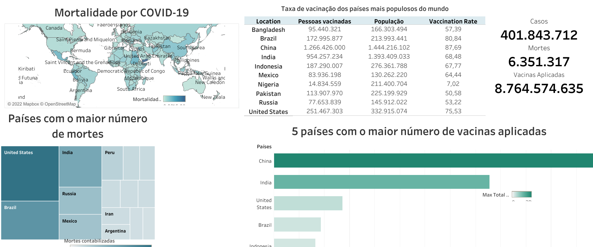

# Análise dos dados de COVID-19

Se fala do coronavírus SARS-CoV-2 desde o final de 2019, mas foi em meados de 2020, que teve um aumento gritante no número de casos e assim, uma pandemia começou. No começo, tudo era mais difícil, já que a ciência ainda não tinha contato com o SARS-CoV-2, leitos de UTI faltando, muitas pessoas morrendo por conta da doença, decreto de quarentena no mundo inteiro. Com o tempo, os estudos foram evoluindo e a vacina foi criada. Atualmente, a doença tem muitas variantes, mas com as medidas preventivas e vacinação em dia, a maioria das pessoas que tem adoecido apresentam sintomas leves e moderados, se recuperando sem tratamento especial.

Com intuito didático, colocando em prática os comandos aprendidos do SQL e também, pesquisando sobre a ferramenta de visualização, Tableau, esse projeto mostra algumas estatísticas do banco de dados da COVID-19 do site <i>Our World in Data</i>.

# Execução

O <i>dataset</i> utilizado encontra-se no repositório da OWID aqui no GitHub. Após isso, é necessário importar a tabela para o ambiente de gerenciamento dos bancos de dados do SQL. São utilizados dois scripts `select_columns.sql`, que cria uma nova tabela com as colunas que são utilizadas nessa análise e também `covid_analysis.sql`, em que foram criadas todas as planilhas utilizadas no Tableau.

# Análise

A partir dos dados escolhidos, que estão em torno de número de casos, mortes e vacinações em relação a localização, nesse caso são os países. Algumas análises foram feitas, como:

* Número de casos, mortes e vacinas para todo o período e todo o mundo
* Mortalidade em relação a doença, então foi calculada a razão do total de mortes pelo total de casos
* Taxa de morte por COVID-19
* Ocupação de leitos por pacientes da UTI
* Taxa de vacinação (o <i>dataset</i> possui a variável `people_vaccinated` que são as pessoas que tomaram pelo menos 1 dose)
* Ranking dos países que mais vacinaram
* Número de novos casos e mortes no Brasil

Tomando essas análises como base para a criação do <i>dashboard</i>. Algumas coisas foram observadas:

* O número de vacinas aplicadas já passa de 8 bilhões, enquanto foram contabilizados mais de 400 milhões de casos e 6.351.317 óbitos no mundo
* Dentre os países com o maior número de mortos, Estados Unidos lidera o <i>ranking</i> com 912.255 mortes e o Brasil com 635.421, lembrando que alguns países não possuem política efetiva contra a doença com várias pessoas desacreditadas que o vírus realmente existe e que pode matar
* Em relação a mortalidade, a maioria dos países possui menos de 5% de morte pela doença, isso se deve ao fato de que no ano de 2021 e início de 2022, as vacinas começaram a ser aplicadas na população, contribuindo para a diminuição de casos graves. Porém, a situação do Iêmen, país do Oriente Médio, é bastante agravante com 18%
* Os países que estão liderando o <i>ranking</i> da vacinação são China, India, Estados Unidos, Brasil e Indonésia. A China por ser o país mais populoso do planeta está lutando para vacinar seus habitantes, e já está com 87,7% das pessoas com pelo menos uma dose da vacina. O Brasil possui 80% das pessoas vacinadas e infelizmente, a Nigéria é um dos países mais populosos que tem baixa taxa de vacinação.

<h1 align="center">
    
</h1>